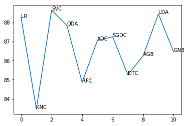

# ML-Fake_News_Stance_Detect
Fake news detection with stance in Consideration [Basic idea from Paper](http://cs229.stanford.edu/proj2017/final-reports/5244160.pdf) [It's Report](http://cs229.stanford.edu/proj2017/final-posters/5148004.pdf)

# Problem
Fake news is deliberate misinformation fabricated with intention of
deception, misleading, grabbing attention or even financial and political
gain. Recent development of machine learning provides a possible solution
to automate this process. However, accurately and repeatedly identifying
fake news is still proven difficult due to the complex nature of human
language. With the popularity of online media and detrimental effect of fake
news on many aspects of our society, developing a reliable machine
learning model for fake news identification becomes very important.

# Baseline implementation with simple machine learning models

## Datasets
* https://github.com/FakeNewsChallenge/fnc-1

1. Logistic Regression 
2. K Nearest Classifier
3. Support Vector Machine Classifier
4. Qudratic Discriminant Analysis
5. Random Forest Classifier
6. Adaboost Classifier
7. SGD Classifier
8. Decision Tree Classifier
9. XG Boost Classifier
10. Linear Discriminant Analysis

# Try more than one models

● Single Model: < 20% accuracy on predictions of “agree” or “disagree” stances.
● Running models on sub-categories yields better predictions on “agree” and “disagree” stances 

Therefore, two types of model combinations are considered. 

● 2-model Combination:
  M1 - Classify related and unrelated stances
  M2 - For related stances, classify agree, disagree, and discuss
● 3-model Combination:
  M1 - Classify related and unrelated stances
  M2 - For related stances, determine whether the stance is neural(discuss) or not
  M3 - For non-neural stances, determine whether the stance is agree or disagree.

# Stance Detection with Deep Learning Model

* http://www.aclweb.org/anthology/N16-1138
* https://www.ijcai.org/proceedings/2017/0557.pdf
* http://www.fakenewschallenge.org/
* https://arxiv.org/abs/1708.05286
* https://web.stanford.edu/class/cs224n/reports/2760496.pdf

OK, BUT WHAT DOES STANCE DETECTION HAVE TO DO WITH DETECTING FAKE NEWS?
ANSWER:
There are two important ways the Stance Detection task is relevant for fake news.

From our discussions with real-life fact checkers, we realized that gathering the relevant background information about a claim or news story, including all sides of the issue, is a critical initial step in a human fact checker’s job. One goal of the Fake News Challenge is to push the state-of-the-art in assisting human fact checkers, by helping them quickly gather the information they need to make their assessment.

In particular, a good Stance Detection solution would allow a human fact checker to enter a claim or headline and instantly retrieve the top articles that agree, disagree or discuss the claim/headline in question. They could then look at the arguments for and against the claim, and use their human judgment and reasoning skills to assess the validity of the claim in question. Such a tool would enable human fact checkers to be fast and effective.

It should be possible to build a prototype post-facto “truth labeling” system from a “stance detection” system. Such a system would tentatively label a claim or story as true/false based on the stances taken by various news organizations on the topic, weighted by their credibility.

For example, if several high-credibility news outlets run stories that Disagree with a claim (e.g. “Denmark Stops Issuing Travel Visas to US Citizens”) the claim would be provisionally labeled as False. Alternatively, if a highly newsworthy claim (e.g. “British Prime Minister Resigns in Disgrace”) only appears in one very low-credibility news outlet, without any mention by high-credibility sources despite its newsworthiness, the claim would be provisionally labeled as False by such a truth labeling system.

In this way, the various stances (or lack of a stance) news organizations take on a claim, as determined by an automatic stance detection system, could be combined to tentatively label the claim as True or False. While crude, this type of fully-automated approach to truth labeling could serve as a starting point for human fact checkers, e.g. to prioritize which claims are worth further investigation.

## Datasets
* https://github.com/FakeNewsChallenge/fnc-1

# Is Title matching with context of body
Idea here is to run the body of a news through text summarization model that will produce a headline.
Then run text similarity between the given headline and the summarization. We should use some kind of transfer learning here.
### Dataset
* https://github.com/dhwajraj/deep-siamese-text-similarity
* https://www.kaggle.com/sunnysai12345/news-summary

# Irony (Used as a feature)
A genuine news article should not be a irony (or should not contain mainly irony sentences)
## Dataset
* https://competitions.codalab.org/competitions/17468

# Fake news classification ( Fake or Not))
## Datasets
* https://www.kaggle.com/jruvika/fake-news-detection/data
* https://www.kaggle.com/mrisdal/fake-news/data
* https://github.com/several27/FakeNewsCorpus

